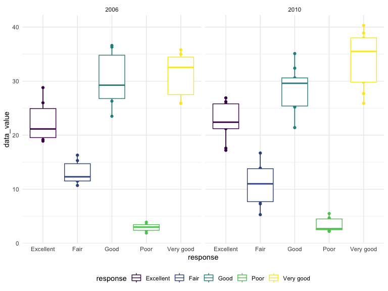
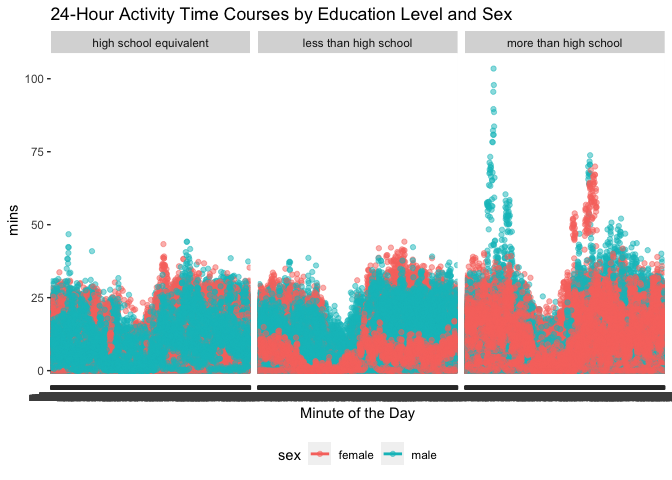

p8105_hw3_ht2607
================

## Question 1

This problem is using the Instacart data. However, I did not download
the dataset into my local data directory; instead, I loaded the data
from the p8105.datasets using the below code.

``` r
library(p8105.datasets)
data("instacart")
```

In the “instacart” dataset, there is total 1384617 observation and 15
variables. Key variables such as order_id (numeric), aisle_id (numeric),
aisel (character), product_id (numeric), order_number (numeric),
product_name (character), and order_hour_of_day (numeric).

Need to answer: How many aisles are there, and which aisles are the most
items ordered from? Make a plot that shows the number of items ordered
in each aisle, limiting this to aisles with more than 10000 items
ordered. Arrange aisles sensibly, and organize your plot so others can
read it. Make a table showing the three most popular items in each of
the aisles “baking ingredients”, “dog food care”, and “packaged
vegetables fruits”. Include the number of times each item is ordered in
your table. Make a table showing the mean hour of the day at which Pink
Lady Apples and Coffee Ice Cream are ordered on each day of the week;
format this table for human readers (i.e. produce a 2 x 7 table).

## Question 2

Step 1: loading the dataset from the p8105 dataset package

``` r
library(tidyverse)
```

    ## ── Attaching core tidyverse packages ──────────────────────── tidyverse 2.0.0 ──
    ## ✔ dplyr     1.1.3     ✔ readr     2.1.4
    ## ✔ forcats   1.0.0     ✔ stringr   1.5.0
    ## ✔ ggplot2   3.4.3     ✔ tibble    3.2.1
    ## ✔ lubridate 1.9.2     ✔ tidyr     1.3.0
    ## ✔ purrr     1.0.2     
    ## ── Conflicts ────────────────────────────────────────── tidyverse_conflicts() ──
    ## ✖ dplyr::filter() masks stats::filter()
    ## ✖ dplyr::lag()    masks stats::lag()
    ## ℹ Use the conflicted package (<http://conflicted.r-lib.org/>) to force all conflicts to become errors

``` r
library(p8105.datasets)
data("brfss_smart2010")
```

Step 2: format the data to use appropriate variable names using clean
name function

``` r
brfss_smart2010 = janitor::clean_names(brfss_smart2010)
names(brfss_smart2010)
```

    ##  [1] "year"                       "locationabbr"              
    ##  [3] "locationdesc"               "class"                     
    ##  [5] "topic"                      "question"                  
    ##  [7] "response"                   "sample_size"               
    ##  [9] "data_value"                 "confidence_limit_low"      
    ## [11] "confidence_limit_high"      "display_order"             
    ## [13] "data_value_unit"            "data_value_type"           
    ## [15] "data_value_footnote_symbol" "data_value_footnote"       
    ## [17] "data_source"                "class_id"                  
    ## [19] "topic_id"                   "location_id"               
    ## [21] "question_id"                "respid"                    
    ## [23] "geo_location"

Step 3: focusing on the “Overall Health” topic

``` r
overall_health_df=
  filter(brfss_smart2010, topic == "Overall Health")
```

Step 4: include only responses from “Excellent” to “Poor”

``` r
overall_health_ep=
  filter(overall_health_df, response == "Excellent" | response == "Very good" | response == "Good" | response == "Fair" | response == "Poor") |>
  mutate(name = forcats::fct_relevel(response, c("Excellent", "Very good", "Good", "Fair", "Poor")))
```

Step 5: organize responses as a factor taking levels ordered from “Poor”
to “Excellent”

``` r
overall_health_ep |> 
  mutate(nameback = forcats::fct_relevel(response, c("Poor", "Fair", "Good", "Very good", "Excellent")))
```

    ## # A tibble: 10,625 × 25
    ##     year locationabbr locationdesc     class topic question response sample_size
    ##    <int> <chr>        <chr>            <chr> <chr> <chr>    <chr>          <int>
    ##  1  2010 AL           AL - Jefferson … Heal… Over… How is … Excelle…          94
    ##  2  2010 AL           AL - Jefferson … Heal… Over… How is … Very go…         148
    ##  3  2010 AL           AL - Jefferson … Heal… Over… How is … Good             208
    ##  4  2010 AL           AL - Jefferson … Heal… Over… How is … Fair             107
    ##  5  2010 AL           AL - Jefferson … Heal… Over… How is … Poor              45
    ##  6  2010 AL           AL - Mobile Cou… Heal… Over… How is … Excelle…          91
    ##  7  2010 AL           AL - Mobile Cou… Heal… Over… How is … Very go…         177
    ##  8  2010 AL           AL - Mobile Cou… Heal… Over… How is … Good             224
    ##  9  2010 AL           AL - Mobile Cou… Heal… Over… How is … Fair             120
    ## 10  2010 AL           AL - Mobile Cou… Heal… Over… How is … Poor              66
    ## # ℹ 10,615 more rows
    ## # ℹ 17 more variables: data_value <dbl>, confidence_limit_low <dbl>,
    ## #   confidence_limit_high <dbl>, display_order <int>, data_value_unit <chr>,
    ## #   data_value_type <chr>, data_value_footnote_symbol <chr>,
    ## #   data_value_footnote <chr>, data_source <chr>, class_id <chr>,
    ## #   topic_id <chr>, location_id <chr>, question_id <chr>, respid <chr>,
    ## #   geo_location <chr>, name <fct>, nameback <fct>

Answering questions: In 2002, which states were observed at 7 or more
locations? What about in 2010?

In this code chuck, I filtered the dataframe to 2002, and group by the
locationabbr variable. Then, I summarizeed to compute multiple summaries
within each group. Last, I filter to states that were observed at 7 or
more locations.

``` r
q1 =
  filter(overall_health_ep, year == "2002") |> 
  group_by(locationabbr) |> 
  summarize(loc = n_distinct(locationdesc)) |> 
  filter(loc >= 7)

q1
```

    ## # A tibble: 6 × 2
    ##   locationabbr   loc
    ##   <chr>        <int>
    ## 1 CT               7
    ## 2 FL               7
    ## 3 MA               8
    ## 4 NC               7
    ## 5 NJ               8
    ## 6 PA              10

In 2002, states that were observed at 7 or more locations are CT, FL,
MA, NC, NJ, and PA.

In this code chuck, I did the similar step as I described for 2002.

``` r
q1_b =
  filter(overall_health_ep, year == "2010") |> 
  group_by(locationabbr) |> 
  summarize(loc = n_distinct(locationdesc)) |> 
  filter(loc >= 7)

q1_b
```

    ## # A tibble: 14 × 2
    ##    locationabbr   loc
    ##    <chr>        <int>
    ##  1 CA              12
    ##  2 CO               7
    ##  3 FL              41
    ##  4 MA               9
    ##  5 MD              12
    ##  6 NC              12
    ##  7 NE              10
    ##  8 NJ              19
    ##  9 NY               9
    ## 10 OH               8
    ## 11 PA               7
    ## 12 SC               7
    ## 13 TX              16
    ## 14 WA              10

In 2002, states that were observed at 7 or more locations are CA, CO,
FL, MA, MD, NC, NE, NJ, NY, OH, PA, SC, TX, and WA.

Construct a dataset that is limited to Excellent responses, and
contains, year, state, and a variable that averages the data_value
across locations within a state.

``` r
q1_c=
  select(overall_health_ep, year, locationabbr, response, data_value) |> 
  filter(response == "Excellent")
```

Make a “spaghetti” plot of this average value over time within a state
(that is, make a plot showing a line for each state across years – the
geom_line geometry and group aesthetic will help).

``` r
q1_c |> 
  group_by(year, locationabbr) |> 
  summarize(avg_data_value = mean(data_value)) |> 
  ggplot(aes(x = year, y = avg_data_value, color = locationabbr)) +
  geom_line(aes(group = locationabbr)) +
  labs(
    x = "Year",
    y = "Average Data Value",
    title = "Spaghetti Plot of Average Data Value by State Over Time"
  ) +
   theme(legend.position = "bottom")
```

    ## `summarise()` has grouped output by 'year'. You can override using the
    ## `.groups` argument.

    ## Warning: Removed 3 rows containing missing values (`geom_line()`).

<!-- -->
The spaghetti plot shows that there is not much different by States’
average data value over time. However, it looks like WY has a dramatic
change from 2004 to 2010.

Make a two-panel plot showing, for the years 2006, and 2010,
distribution of data_value for responses (“Poor” to “Excellent”) among
locations in NY State.

``` r
library(ggplot2)
q1_d=
  select(overall_health_df, year, locationabbr, response, data_value) |> 
  filter(locationabbr == "NY", year == 2006 | year == 2010) |> 
  group_by(locationabbr, year) |> 
  ggplot(aes(x = response, y = data_value, color = response)) +
  geom_point() + geom_line() +
  geom_boxplot() +
  facet_grid(year ~ ., scales = "free_y")
  labs(
    x = "Response",
    y = "Data Value",
    title = "Distribution of Data Value by Response in New York State (2006 and 2010)"
  ) +
   theme(legend.position = "bottom")
```

    ## NULL

``` r
q1_d
```

<!-- -->
From the two panel plot, we can see that majority of the responses for
the services from 2006 to 2010 are fall under excellent, very good, and
good. However, we do see that there are less than 20 of data value that
responses fair in 2006. In addition, there is less than 10 data values
that have response of poor in both 2006 and 2010.

## Question 3

Step 1: imported and loaded both csv files. Also, tidy, merge, and
otherwise organize the data sets. Your final dataset should include all
originally observed variables; exclude participants less than 21 years
of age, and those with missing demographic data. In addition, encode
data with reasonable variable classes (i.e. not numeric, and using
factors with the ordering of tables and plots in mind).

``` r
library(tidyverse)
accel = read_csv(file = "./q3data/nhanes_accel.csv", na = "NA") |>
  janitor::clean_names() |> 
  pivot_longer(
    min1:min1440,
    names_to = "minutes", 
    values_to = "mins")
```

    ## Rows: 250 Columns: 1441
    ## ── Column specification ────────────────────────────────────────────────────────
    ## Delimiter: ","
    ## dbl (1441): SEQN, min1, min2, min3, min4, min5, min6, min7, min8, min9, min1...
    ## 
    ## ℹ Use `spec()` to retrieve the full column specification for this data.
    ## ℹ Specify the column types or set `show_col_types = FALSE` to quiet this message.

``` r
covar = read_csv(file = "./q3data/nhanes_covar.csv", skip = 4, na = "NA") |>
  janitor::clean_names() |> 
  filter(age >= 21 | is.na(age)) |> 
  drop_na() |> 
  mutate(
    sex = 
      case_match(
        sex, 
        1 ~ "male", 
        2 ~ "female"),
    sex = as.factor(sex)) |> 
  mutate(
    education = 
      case_match(
        education, 
        1 ~ "less than high school", 
        2 ~ "high school equivalent", 
        3 ~ "more than high school"),
    education = as.factor(education)) |> 
   mutate(school = forcats::fct_relevel(education, c("less than high school", "high school equivalent", "more than high school")))
```

    ## Rows: 250 Columns: 5
    ## ── Column specification ────────────────────────────────────────────────────────
    ## Delimiter: ","
    ## dbl (5): SEQN, sex, age, BMI, education
    ## 
    ## ℹ Use `spec()` to retrieve the full column specification for this data.
    ## ℹ Specify the column types or set `show_col_types = FALSE` to quiet this message.

``` r
q3tidy_df = 
  inner_join(covar, accel, by = "seqn")
```

Step 2: Produce a reader-friendly table for the number of men and women
in each education category

``` r
covar |> 
  count(sex, school) |> 
  pivot_wider(
  names_from = sex, 
  values_from = n) |> 
  janitor::clean_names() |> 
knitr::kable()
```

| school                 | female | male |
|:-----------------------|-------:|-----:|
| less than high school  |     28 |   27 |
| high school equivalent |     23 |   35 |
| more than high school  |     59 |   56 |

We can see that majority of the numbers of men and women are fall within
the more than high school education category. Also, there are more males
compared to females in the high school equivalent category. Lastly, in
the less than high school category, the numbers of female and male are
relatively the same.

Step 3: create a visualization of the age distributions for men and
women in each education category

``` r
covar |> 
 ggplot(aes(x = age, fill = sex)) +
  geom_density(alpha = .5) + 
  facet_grid(education ~ .) + 
  labs(
    x = "Age",
    y = "Count",
    title = "Age distributions for men and women in each education category"
  ) 
```

<!-- -->

``` r
  viridis::scale_fill_viridis(discrete = TRUE)
```

    ## <ggproto object: Class ScaleDiscrete, Scale, gg>
    ##     aesthetics: fill
    ##     axis_order: function
    ##     break_info: function
    ##     break_positions: function
    ##     breaks: waiver
    ##     call: call
    ##     clone: function
    ##     dimension: function
    ##     drop: TRUE
    ##     expand: waiver
    ##     get_breaks: function
    ##     get_breaks_minor: function
    ##     get_labels: function
    ##     get_limits: function
    ##     guide: legend
    ##     is_discrete: function
    ##     is_empty: function
    ##     labels: waiver
    ##     limits: NULL
    ##     make_sec_title: function
    ##     make_title: function
    ##     map: function
    ##     map_df: function
    ##     n.breaks.cache: NULL
    ##     na.translate: TRUE
    ##     na.value: NA
    ##     name: waiver
    ##     palette: function
    ##     palette.cache: NULL
    ##     position: left
    ##     range: environment
    ##     rescale: function
    ##     reset: function
    ##     scale_name: viridis
    ##     train: function
    ##     train_df: function
    ##     transform: function
    ##     transform_df: function
    ##     super:  <ggproto object: Class ScaleDiscrete, Scale, gg>

In the visualization of the age distribution for men and women in each
education category, we can see that more females that is less than age
of 50 are in the more than high school education category. Also, we can
see that there is more females that age more than 60 are in the high
school equivalent education category. Additionally, there is more males
that age less than 50 are in the high school equivalent education
category.

Plot these total activities (y-axis) against age (x-axis); your plot
should compare men to women and have separate panels for each education
level. Include a trend line or a smooth to illustrate differences.

``` r
q3tidy_df|> 
  group_by(education, sex, age) |> 
  summarise(Total_Activity = sum(mins)) |> 
  ggplot(aes(x = age, y = Total_Activity, color = sex)) + 
    geom_point(alpha = .5) +
    geom_smooth(se = FALSE) + 
    facet_grid(education ~ .) +
    labs(
      x = "Age",
      y = "Total Activity",
      title = "Total Activity vs. Age by Education Level and Gender"
   )
```

    ## `summarise()` has grouped output by 'education', 'sex'. You can override using
    ## the `.groups` argument.
    ## `geom_smooth()` using method = 'loess' and formula = 'y ~ x'

<!-- -->

``` r
    theme(legend.position = "bottom")
```

    ## List of 1
    ##  $ legend.position: chr "bottom"
    ##  - attr(*, "class")= chr [1:2] "theme" "gg"
    ##  - attr(*, "complete")= logi FALSE
    ##  - attr(*, "validate")= logi TRUE

In the “Total activity vs age by education level and gender” graph, we
can see the among the high school equivalent education group, the trend
of total activity has increase, specifically from the age 70 and above.
However, in the less than high school education group, the trend of
total activity decrease particularly for male that is age 60 and above.
However, there are higher total activity among those who is under age of
50 in the more than high school education group.

Make a three-panel plot that shows the 24-hour activity time courses for
each education level and use color to indicate sex.

``` r
q3tidy_df |> 
  ggplot(aes(x = minutes, y = mins, color = sex)) +
    geom_point(alpha = .5) +
  geom_smooth(se = FALSE) +
    facet_grid(education ~ .) +
    labs(
      x = "Minute of the Day",
      y = "mins",
      title = "24-Hour Activity Time Courses by Education Level and Sex"
    ) +
   theme(legend.position = "bottom")
```

    ## `geom_smooth()` using method = 'loess' and formula = 'y ~ x'

<!-- -->
Based on this graph, we can conclude that there are more males in the
high school equivalent education category compared to females in the 24
hours activity time courses. However, more females compared to males in
the more than high school education category in the 24 hours activity
time courses.
